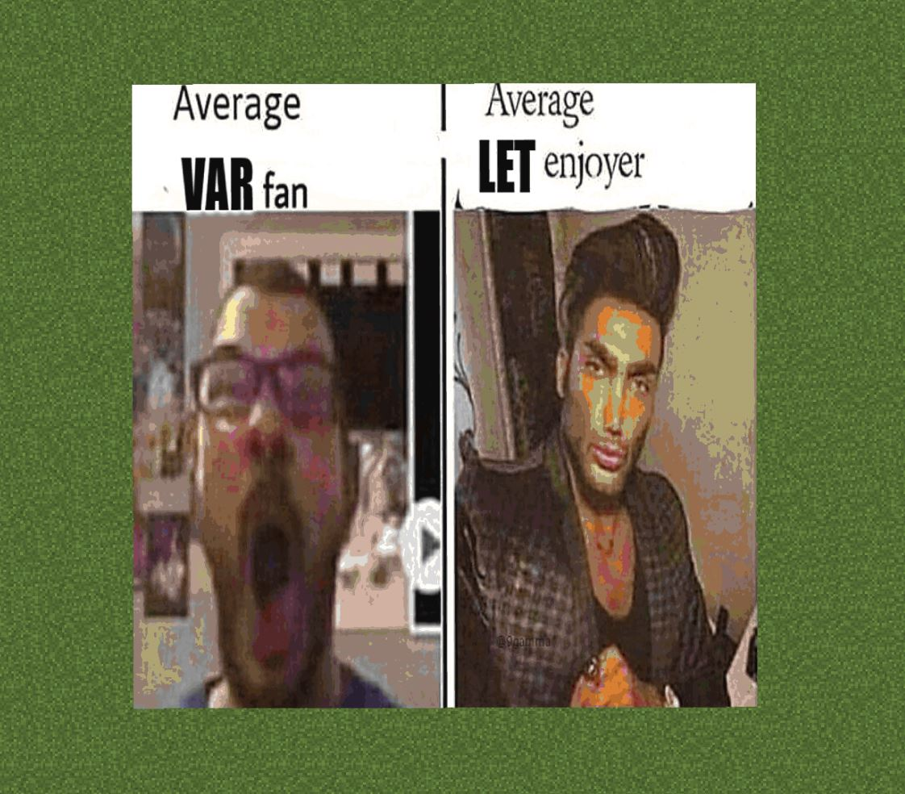

# Minecraft Map Art Generator Utility
A (hopefully) useful utility that converts images to map arts for Minecraft, while this is not entirely new thing, I wanted to try and better the current solutions to the problem.  However, I must give a big thanks to the developer(s) of [mc-map-item-tool](https://github.com/djfun/mc-map-item-tool) as that allowed me to view their implementation so I could better my own <3

## Installation
Currently, since I have only written a script for Windows for installation but expect a Linux bash script to be added soon!
### Windows
Make sure to have Python3 and Node.js installed then run `install.bat`, this should download any required modules and files.  This will scrape the Minecraft Wiki for any of the new colour sets for future versions so please bear this in mind.

## Testing
If you want to validate that everything it working correctly, you may use mocha to test the software by running the command `npm test`.  All of the required files for testing should be built in so nothing extra should be required.